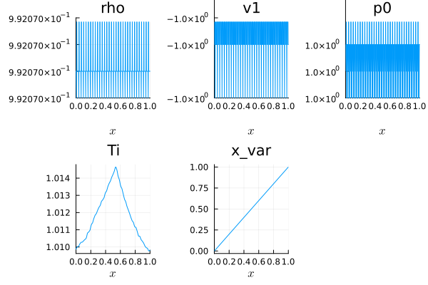
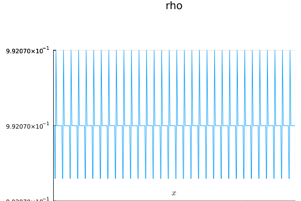
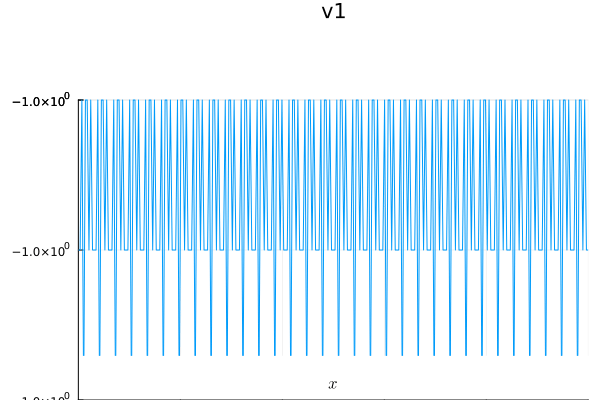
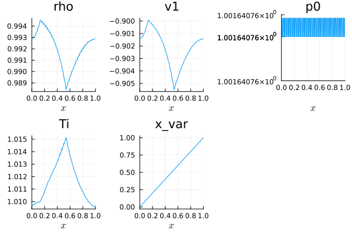

# Tutorial for the 1D Model

In this section, we describe how to use **TermiteMoundInducedAirflowTrixi.jl** with **Trixi.jl**. This tutorial will guide you through setting up and running a 1D airflow simulation, including mesh creation, boundary conditions, numerical fluxes, and visualization of results.

## Packages 

Before starting, ensure that the required packages are loaded:
```julia
using Pkg

Pkg.add(["TermiteMoundInducedAirflowTrixi", "Trixi", "Trixi2Vtk",
    "OrdinaryDiffEqLowStorageRK", "Interpolations", "QuadGK",
    "FastGaussQuadrature", "Plots"])

using TermiteMoundInducedAirflowTrixi,
    Trixi,
    Trixi2Vtk,
    OrdinaryDiffEqLowStorageRK,
    Interpolations,
    QuadGK,
    FastGaussQuadrature,
    Plots
```

## Import Functions

Next, we load some functions from different packages:
```julia
using Trixi: AbstractEquations, @muladd
import Interpolations: Line
import Trixi:
    flux_ranocha,
    ln_mean,
    inv_ln_mean,
    flux,
    varnames,
    cons2cons,
    cons2prim,
    prim2cons,
    cons2entropy,
    max_abs_speeds
```

## Equations

The first step is to set define the model parameters. The function `termite_parameters(r,h)` generates all required parameters given a radius r and a height h:

```julia
radius = 0.6;
height = 2.0;
(γ, k_i, k_w, tᵣ, uᵣ, xa, xb, xc, r, h, L, β, η, Fr², ρₕ₀, T_ref, t_ref, T0, v0, Ti_LI) =
    termite_parameters(radius, height);
equations = TermiteMoundEquations1D(; γ, k_i, k_w, tᵣ, uᵣ, xa, xb, xc, r, h,
    L, β, η, Fr², ρₕ₀, T_ref, t_ref, T0, v0, Ti_LI);
```

## Initial state and flux functions

Next, we set the initial state, volume flux and surface flux functions in our equation system:
```julia
initial_condition = TermiteMoundInitialCondition;
volume_flux = flux_ranocha;
surface_flux = flux_ranocha;
```

## Semidiscretization

The polynomial degree for the `DGSEM` can be specified now:
```julia
dg = DGSEM(
    polydeg = 4,
    surface_flux = flux_ranocha,
    volume_integral = VolumeIntegralFluxDifferencing(volume_flux),
);
```

We define a one-dimensional Tree mesh, which discretizes the (scaled) spatial domain:
```julia
mesh = TreeMesh(
    (0.0,),
    (1.0,),
    initial_refinement_level = 5,
    n_cells_max = 1000,
    periodicity = true,
);
```

The semidiscretization is now defined:
```julia
semi = SemidiscretizationHyperbolic(
    mesh,
    equations,
    initial_condition,
    dg,
    source_terms = source_terms,
    boundary_conditions = boundary_condition_periodic,
);
```

## Solvers and callbacks

We want to simulate a full day. In this case we set the time span to:
```julia
tspan = (0.0, 1.0) .* 86400 ./ equations.tᵣ;
ode = semidiscretize(semi, tspan);
```

For time integrations we will always use the `CarpenterKennedy2N54` algorithim.
Therefore, the `UpdateVelocityCallback` is defined as:
```julia
update_velocity_callback =
    UpdateVelocityCallback(CarpenterKennedy2N54(williamson_condition = false));
```

We add a `Summary`, `Stepsize` and `AMRCallback` to complete our callback set:
```julia
summary_callback = SummaryCallback();
stepsize_callback = StepsizeCallback(cfl = 0.3);
amr_controller = ControllerThreeLevel(
    semi,
    IndicatorMax(semi, variable = (u, equations) -> u[2]),
    base_level = 5,
    max_level = 6,
    max_threshold = -0.35,
);
amr_callback = AMRCallback(
    semi,
    amr_controller,
    interval = 1,
    adapt_initial_condition = true,
    adapt_initial_condition_only_refine = true,
);
callbacks = CallbackSet(summary_callback, stepsize_callback, update_velocity_callback);
```

## Run the simulation

Finally, we can solve the sysstem of equations.
We save our solution across multiple points in time.
 ```julia
sol = solve(
    ode,
    CarpenterKennedy2N54(williamson_condition = false);
    dt = 1.0,
    ode_default_options()...,
    saveat = (tspan[end]-tspan[1])/24/2,
    callback = callbacks,
);
```

## Solution plots

Our simulation started with a constant initial state of `rho`and `v1`.
The leading order pressure is always constant in `x`.
We can plot the initial state of our flow quanities using:
 ```julia
pd_init = PlotData1D((x, equations) -> initial_condition(x, last(tspan), equations), semi);
plot(pd_init)
```



The time evolution of the density can be visualized using:
 ```julia
anim_rho = @animate for i ∈ 1:length(sol.t)
    pd_rho = PlotData1D(sol.u[i], semi)
    plot(pd_rho["rho"])
end
gif(anim_rho, "rho.gif", fps = 5)
```



The velocity behaviour can be ploted similarly:
 ```julia
anim_v = @animate for i ∈ 1:length(sol.t)
    pd_v = PlotData1D(sol.u[i], semi)
    plot(pd_v["v1"])
end
gif(anim_v, "v.gif", fps = 5)
```



The final state of the system variables can be visualized via:
 ```julia
pd = PlotData1D(sol)
plot(pd)
```
